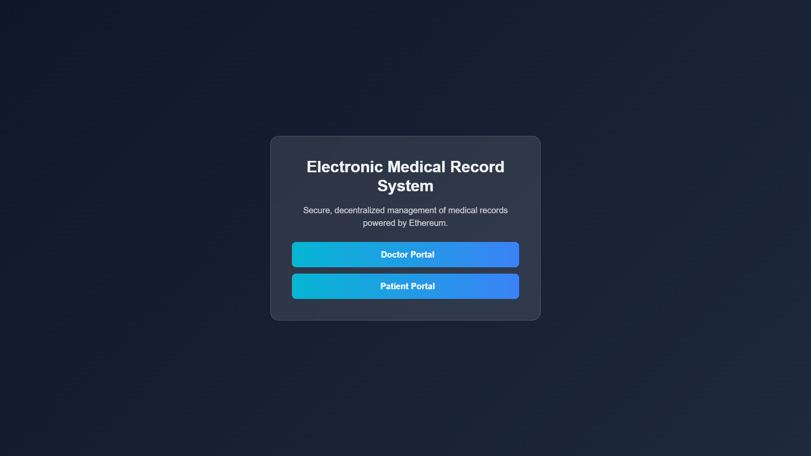
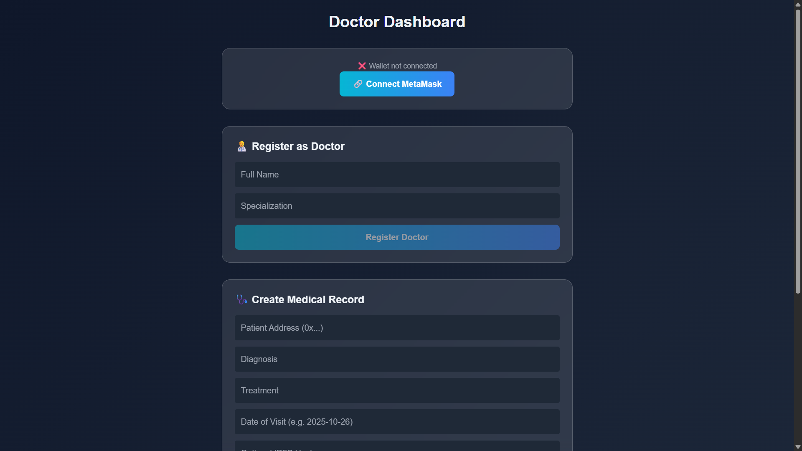
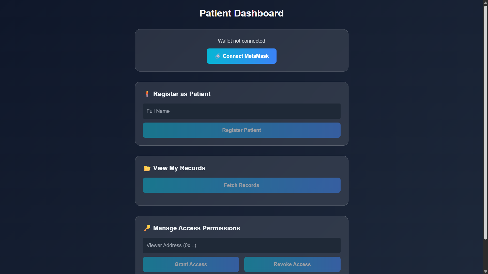
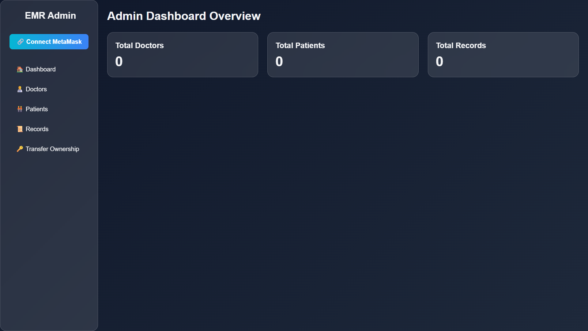

# Electronic Medical Record (EMR) System — Blockchain Based

This is a **sample Electronic Medical Records Management System** built using a **Solidity smart contract** deployed on the **Sepolia Test Network**, with a simple **HTML + JavaScript** frontend.

The project demonstrates how blockchain can be used to securely register users (doctor/patient) and store/view medical records without a centralized server.

---

### Overview


### Doctor Portal


### Patient Portal


### Admin Panel


---

## Features

- **Blockchain-based EMR system** (Sepolia testnet)
- **Two portals:**
  - **Doctor Portal**
    - Connect wallet (MetaMask preferred)
    - Register as a doctor
    - Create medical records for patients
    - View existing records
  - **Patient Portal**
    - Connect using a patient wallet
    - Register as a patient
    - View personal medical records
- **Admin Page**
  - Overview of doctors, patients, and their records
- Frontend built with **HTML + JS**
- Smart contract located at: `contracts/emr.sol`

---

## Contract Setup (IMPORTANT)

The frontend will not work until you add your **contract ABI** and **contract address**.

You must paste these into:

- `index.js`
- `admin.js`

### How to retrieve ABI & Contract Address

1. Open `contracts/emr.sol` in **Remix IDE**.  
2. Compile the smart contract.  
3. Deploy it using **Injected Provider (MetaMask)** on the **Sepolia testnet**.  
4. Copy:
   - **Contract Address** (from deployed instance)
   - **ABI JSON** (from Remix compiler details)

Paste them into your JS files:

```javascript
const contractABI = [ /* paste ABI here */ ];
const contractAddress = "0xYourContractAddress";
